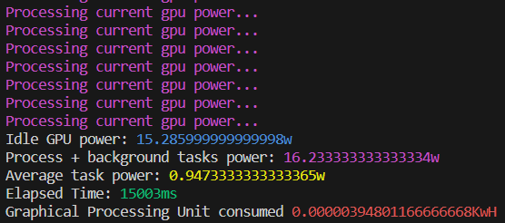

# Node.js Projects repository

<div style="display:flex; flex-wrap:wrap;">
  <p style="flex: 1 1 540px;">
    This repository contains multiple projects developed in Node.js that explore various aspects and applications. The projects are mostly developed under a CLI or console interface.
  </p>
  
</div>

## Projects

### [Memoization](./memoization)

This project implements the Fibonacci sequence using memoization technique. It includes both recursive and iterative versions of the Fibonacci algorithm. The recursive version recursively calculates the Fibonacci numbers, while the iterative version uses a loop to compute them. The purpose of this project is to compare the performance and efficiency of the two approaches.

### [Power Consumption](./power-consumption)

This project focuses on monitoring and analyzing power consumption data. It provides a set of tools and utilities to collect power consumption data from various sources and perform analysis on the collected data. The project aims to help users (programmers and PC users) understand and optimize power consumption in their systems and applications.



## Requirements

Before running the projects in this repository, please ensure that you have the following requirements installed on your machine:

1. [Node.js](https://nodejs.org/): Make sure you have Node.js installed on your system. You can download it from the official Node.js website: [https://nodejs.org/](https://nodejs.org/).

2. [Git](https://git-scm.com/): Git is used for version control and is required to clone this repository and manage the project files. If you don't have Git installed, you can download it from the official Git website: [https://git-scm.com/](https://git-scm.com/).

Please make sure to install these requirements before proceeding with the projects in this repository.

## Usage

Each project in this repository is organized within its own directory and can be executed independently. If you're interested in a specific project, simply click on its directory, and the corresponding Readme.md file will provide instructions on how to run it. Feel free to clone this repository without hesitation, as the dependencies are not uploaded, and it will not occupy much space on your system.

1. Clone this repository

```
git clone https://github.com/A-Cobra/node
```

2. Move to the develop branch

```
git checkout develop
```

3. Double-click on the project folder that interest you the most

4. Read and follow along the instructions provided in the Readme.md files

## License

This project is licensed under the [Apache License 2.0](./LICENSE).

## Conclusion

This repository contains a collection of Node.js projects that showcase different JavaScript/Node.js technologies and concepts. Each project provides a simple example of how to use a particular technology or implement a particular feature. Whether you are new to JavaScript development or an experienced developer, these projects can help you learn new skills and improve your Node.js programming abilities.
