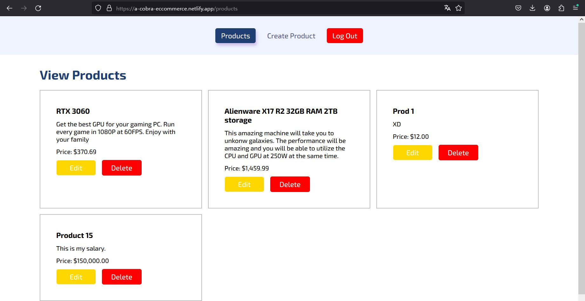
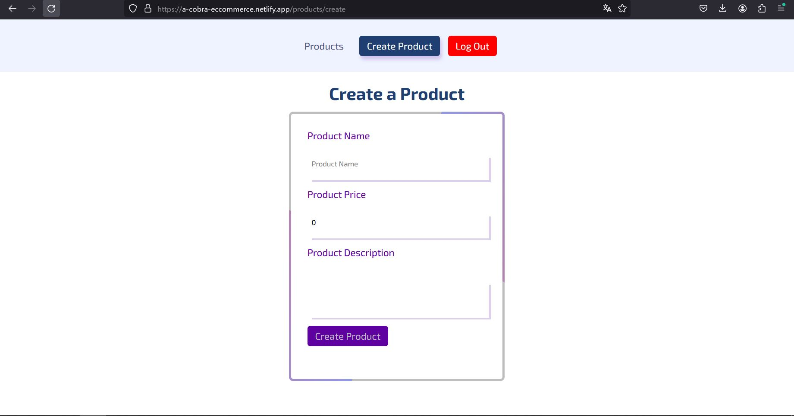
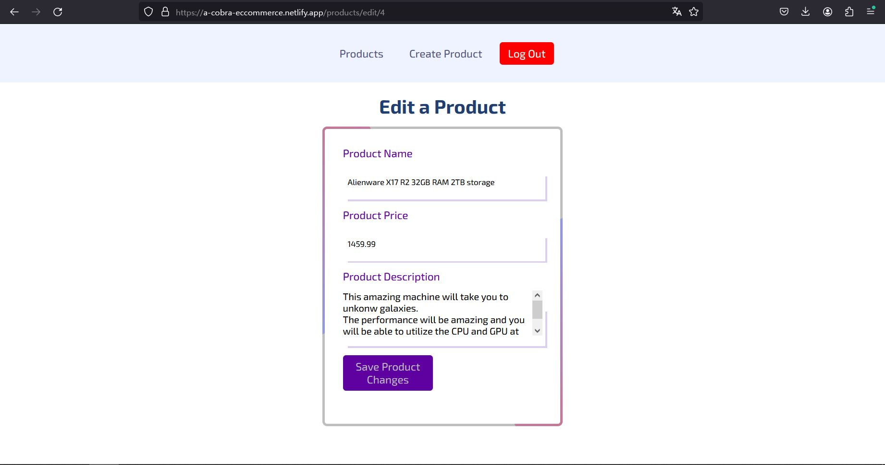
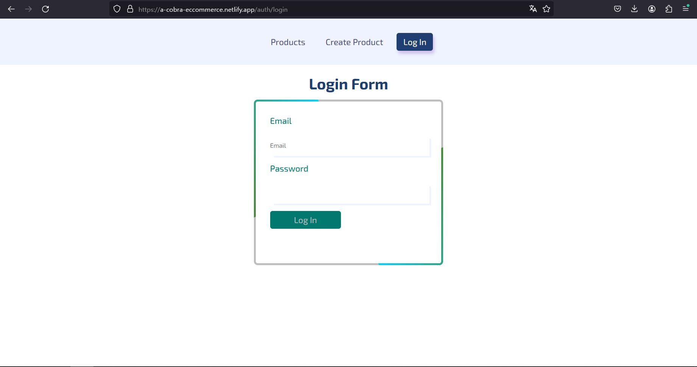
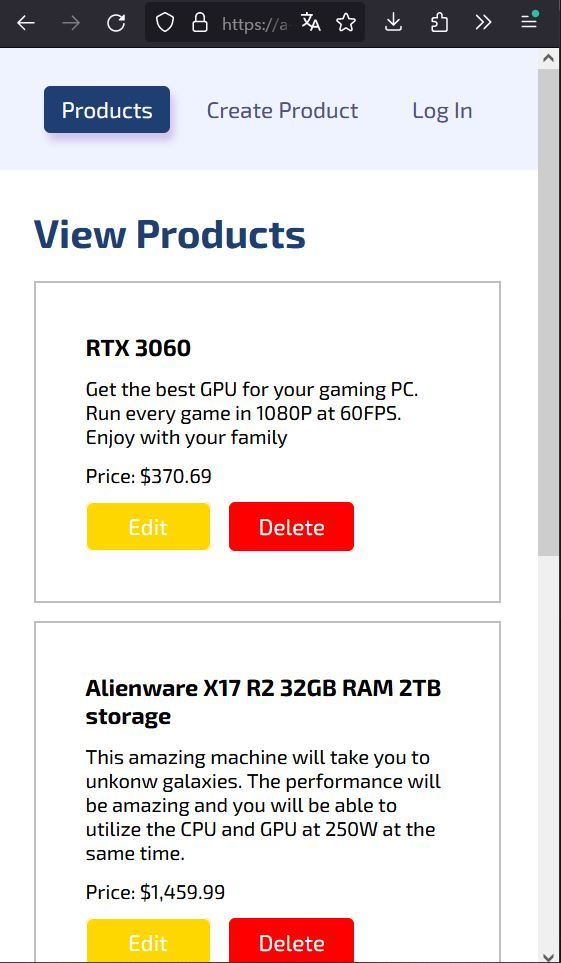

# Full stack E-commerce app

This is an e-commerce management tool built using Angular for the frontend and Node.js with Express for the backend. The application allows users to create, visualize, edit, and delete products. It focuses on security, error handling, and providing a seamless user experience.

<a href="https://a-cobra-eccommerce.netlify.app" target="_blank"></a>

**Note:** The application may take some time to fetch data initially since the backend is deployed on a free instance, which requires a few minutes to start. However, once it is running, the application performs smoothly.

## Features

- **Authentication and Security**: The system utilizes JWT (JSON Web Tokens) for authentication. It uses both refresh and access tokens to grant security permissions to users. An authentication middleware is implemented to authenticate users and provide them with appropriate permissions.

- **Single Device Login**: Currently, the application only allows users to be logged in on one device at a time. This behavior can be modified with some code modifications.

- **Notifications**: The application includes a notification feature that enhances the user experience by displaying notifications for important events and actions.

- **Product Creation Limit**: There is a feature in the Node.js server that restricts users from creating more than a certain number of products. The current limit is set to 6, but it can be modified by changing the value in the environment (env) file.

- **Security and Error Handling**: The application places a strong emphasis on security and error handling. It includes various mechanisms to handle errors, such as the usage of interceptors to retry requests and provide graceful error responses.

## Screenshots

Main Page



Create product



Edit product



Login page



Mobile experience



## Requirements

Before running the application, make sure you have [Node.js](https://nodejs.org) (minimum version 12.0.0), git, and [Angular CLI](https://angular.io/cli) installed on your machine.

Use the package manager [npm](https://www.npmjs.com/) to install the dependencies and run the application.

## Usage

After sufficing the requirements for the app, follow the steps in order to run the program:

1. Access the deployed app using the following link:

   [https://a-cobra-eccommerce.netlify.app](https://a-cobra-eccommerce.netlify.app)

2. If you prefer to have a hands-on experience and perform the task manually, you can clone the repository by executing the following command:

   ```bash
   git clone https://github.com/A-Cobra/node.git
   ```

3. Open the newly clone folder called `node`

4. Switch to the develop branch using the following git command

   ```
   git checkout develop
   ```

5. Navigate to the backend directory:

   ```
   fullstack-ecommerce-v1/backend
   ```

6. Install the necessary dependencies by running the following command:

   ```
   npm install
   ```

7. Create a database with the following three tables:

   - user
   - product
   - active_refresh_token

8. Create a .env file in the current directory and fill in the following information:

   ```
   HOST={YOUR_HOST}
   USER={YOUR_USER}
   PASSWORD={YOUR_PASSWORD}
   DATABASE={YOUR_DATABASE_NAME}
   API_PORT=3500
   AUTH_SERVER_API_PORT=4000
   PRODUCT_TABLE_NAME=product
   USER_TABLE_NAME=user
   VALID_REFRESH_TOKENS_TABLE_NAME=active_refresh_token
   MAX_NUMBER_OF_PRODUCTS={YOUR_MAX_NUMBER_OF_PRODUCTS}
   JWT_SECRET={YOUR_JWT_SECRET}
   JWT_REFRESH_SECRET={YOUR_JWT_REFRESH_SECRET}
   ```

9. Start the products server by running the following command:

   ```
   npm run start
   ```

10. Start the auth server by using the following command:

    ```
    npm run auth-server
    ```

11. In a separate terminal, navigate to the frontend directory:

    ```
    fullstack-ecommerce-v1/frontend
    ```

12. Install the necessary dependencies by running the following command:

    ```
    npm install
    ```

13. To spin up the frontend, use the following command:

    ```
    npm run sto
    ```

14. If the website has not been automatically opened yet, please visit the following link:

    ```

    localhost:4200

    ```

These instructions should help you run the application either through the deployed link or by running it locally. Make sure to replace the .env file with the appropriate values specific to your setup.

## Backend Technologies

- **Node.js with Express**: Backend framework for building scalable and robust APIs.
- **ESLint**: Linting tool for maintaining code quality and consistency.
- **Nodemon**: Utility for automatically restarting the server during development.
- **MySQL**: Relational database for storing application data.
- **JWT**: JSON Web Tokens for authentication and security.
- **Microservices**: Architecture that divides the application into two servers, namely the authentication server and the products server.
- **MongoDB**: NoSQL database used for specific purposes in the application.

## Frontend Technologies

- **Angular**: Frontend framework for building responsive and dynamic user interfaces.
- **Angular Material**: UI component library for creating beautiful and consistent UI elements.
- **ESLint**: Linting tool for maintaining code quality and consistency.
- **HTTP Interceptor**: Intercepts and modifies HTTP requests for various purposes.
- **JWT**: JSON Web Tokens for authentication and security.
- **Error Handling**: Implementation of error handling mechanisms for graceful error management.
- **Notifications**: Feature for displaying notifications to improve the user experience.

## Considerations:

To generate permissions and user accounts for product deletion, please follow the steps below:

1. Navigate to the backend directory:

   ```
   fullstack-ecommerce-v1/backend
   ```

2. Locate the file named `generate-password.js` within the utils directory.

3. In the generate-password.js file, locate the variable `'your_password_here'` and replace it with the desired password for your user.

4. Save the changes to the generate-password.js file.

5. Open a command line interface and navigate to the backend directory:

   ```
   cd fullstack-ecommerce-v1/backend
   ```

6. Generate the password by running the following command:

   ```
   node .\utils\generate-password.js
   ```

   The generated password will be displayed in the console output.

7. Copy the hashed password form the output

8. Access your database and locate the user table.

9. Insert a new row into the user table with the appropriate email and the hashed password obtained from the previous step.

## License

This project is released under the Apache 2.0 license. Please see the [LICENSE](../LICENSE) file for more details.
