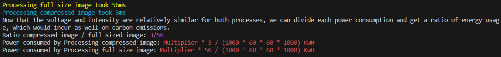

# Power Consumption Reader

This Node.js application is designed to read the power consumption of an app. It provides three main functions for calculating power consumption using different approaches. The application also includes a `main` method that calls these three functions.

## Features

- `getPowerConsumptionByCompressionApproach`: Calculates power consumption based on the data size and relates to compression.
- `getPowerConsumptionByGraphicsCard`: Calculates power consumption based on the graphics card power.
- `getPowerConsumptionByTimeDrivenApproach`: Calculates power consumption based on the length and efficiency of algorithms.

## Screenshots




## Installation

Before running the application, make sure you have [Node.js](https://nodejs.org) installed on your machine (minimum version 12.0.0).

Use the package manager [npm](https://www.npmjs.com/) to install the dependencies and run the application.

## Usage

After sufficing the requirements for the app, follow the steps in order to run the program:

1.  Clone the repository by using the following command

```
git clone `https:github.com/A-Cobra/node`
```

2.  Use the git command

```
git checkout develop
```

3.  open the `power-consumption` folder with your favorite ide

4.  Use the following command

```
npm install
```

5.  Finally, run the app by using the command

```
node main
```

## Folder Structure

- calculation-methods: Contains the three main functions for power consumption calculations.
- models: Contains the TimeManager model.
- utils: Contains utility functions to aid the three methods from the calculation-methods folder.
- resources: Contains additional resources such as images.

## Dependencies

This application relies on the following dependency:

- [systeminformation](https://www.npmjs.com/package/systeminformation): Used to gather system information.

## Additional Information

It's important to note that the project does not include a method for directly measuring CPU consumption. This is because CPU consumption is influenced by various factors, such as the number of cores, utilization, and other variables. While tools like `Intel Power Gadget` can provide overall power measurements, they do not calculate energy consumption specifically for a particular process.

## License

This project is licensed under the [Apache License 2.0](../LICENSE).
